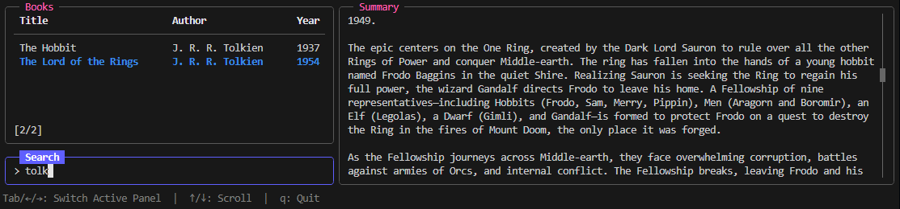

A proof of concept example written in Go for rendering UI in the console using the Bubble Tea framework.

A book selection demo TUI. It features a layout that automatically resizes based on the terminal size. The app display 3 panels: `Books`, `Summary` and `Search`. The first column is a fixed width of 60 characters. The second column fill the remaining space. On the left column, the bottom cell shows the ***Search*** panel that is a fixed height of 3 lines while the ***Books*** panel fill the remaining height. 

Screenshot:

